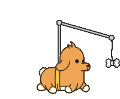

 
  <picture></picture>

 
 
Hi there, I am Rishu 👋. I’m currently a final year Masters student at <strong><a href="https://www.nyu.edu">NYU</a></strong>. I have previously worked as a developer for ~3 years at <strong><a href="https://www.jpmorganchase.com">JP Morgan Chase</a></strong>. It's nice to meet you 😁
 
<h3>🔍 Where to find me</h3>

 

 
 

 
  <picture></picture>

 
<h3 align="center"">🏃Things that get me moving</h3>

 
  Coding 💻, Systems 📚 & Algorithms 📠 
  Music ğŸ§, Anime 🥠& Travelling 🌴 
  Dogs 🶠& Coffee :coffee:  

 
 
 

<!--
**s-rishu/s-rishu** is a ✨ _special_ ✨ repository because its `README.md` (this file) appears on your GitHub profile.
- I love coding, algorithms, systems and dogs.
- Oh and I also love travelling, music and anime ✨
- 
Here are some ideas to get you started:

- 🔭 I’m currently working on ...
- 🌱 I’m currently learning ...
- 👯 I’m looking to collaborate on ...
- 🤔 I’m looking for help with ...
- 💬 Ask me about ...
- 📫 How to reach me: ...
- 😄 Pronouns: ...
- ⚡ Fun fact: ...
-->

 
  YOU ARE VISITOR NUMBER: 
  

 

 
  <picture></picture>

